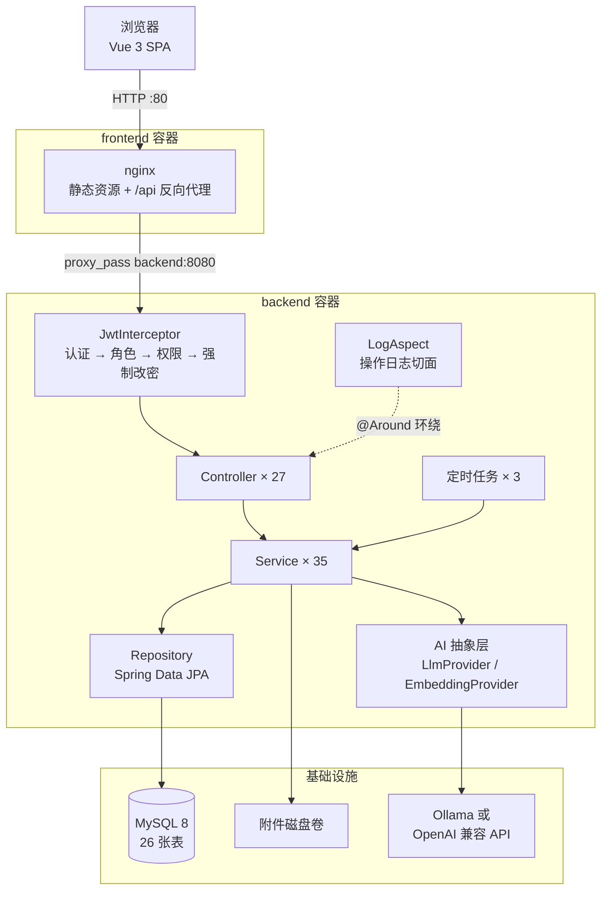
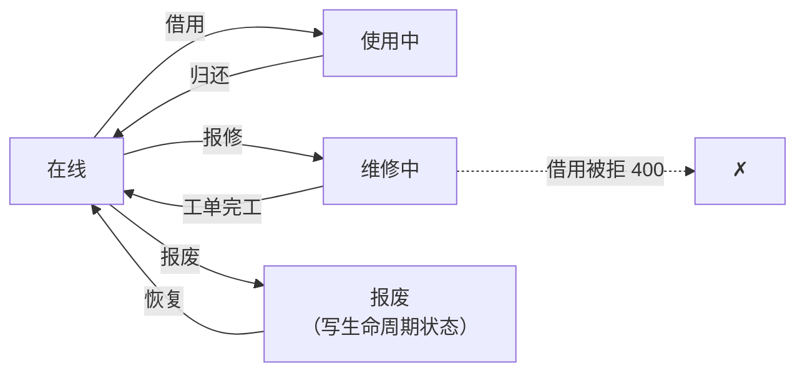
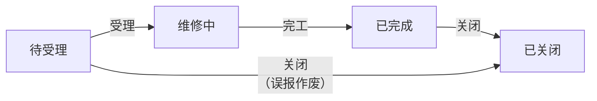
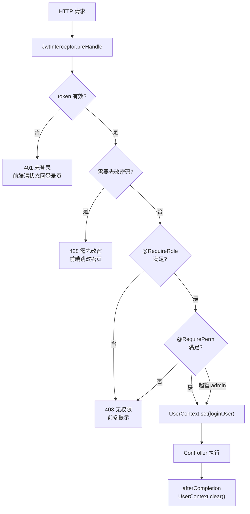
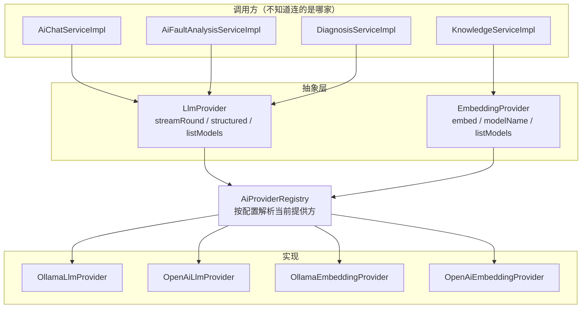
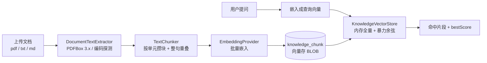
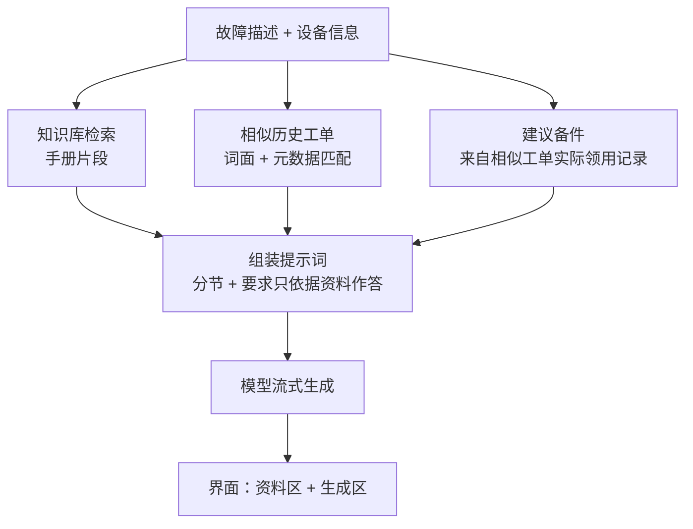
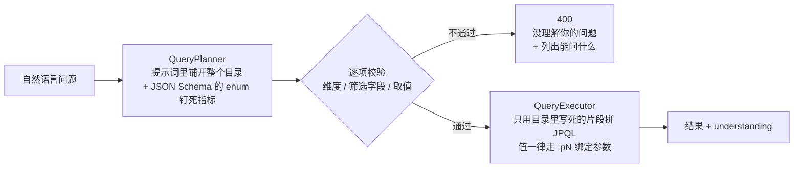
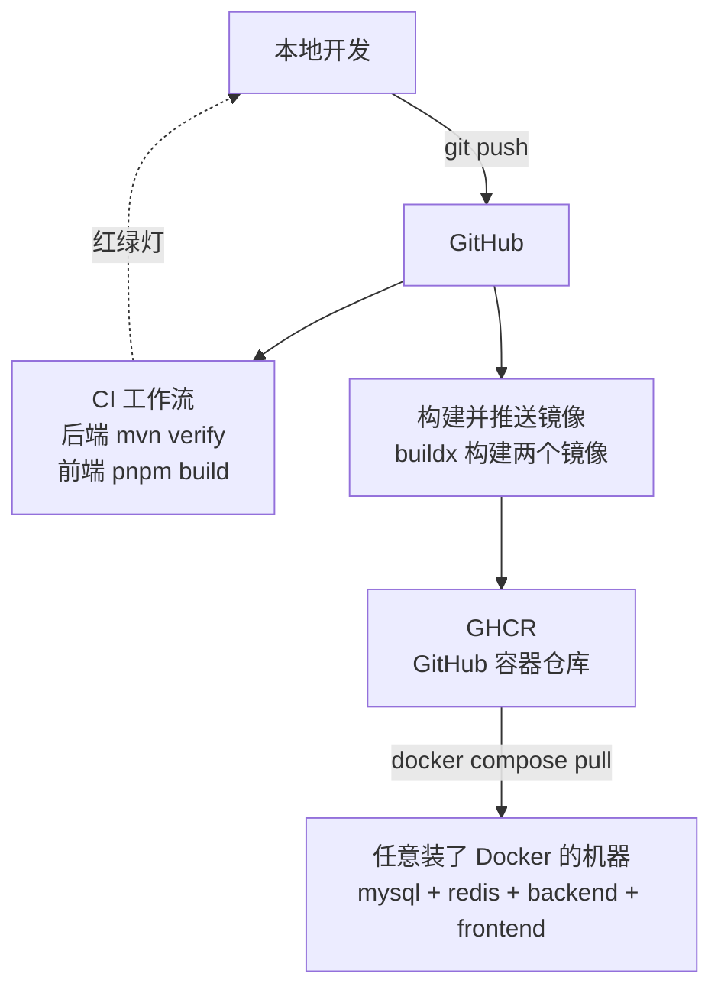

# 设备管理系统

[](https://github.com/geg18539-pixel/device-management-system/actions/workflows/ci.yml)
[](https://github.com/geg18539-pixel/device-management-system/actions/workflows/docker.yml)


一个前后端分离的**企业设备资产管理系统**。覆盖设备从建档、调拨、借用到报修、维保、报废的完整生命周期，
并在业务层之上叠了一套本地大模型驱动的 AI 能力：能查库的对话助手、基于 RAG 的故障诊断、
受控的自然语言问数、设备关系图谱。

**规模**：269 个 Java 源文件 · 27 个 Controller · 24 张业务表 · 25 个前端页面 · 26 条业务路由。

---

## 目录

- [一、这个项目的几个特点](#一这个项目的几个特点)
- [二、界面展示](#二界面展示)
- [三、技术栈](#三技术栈)
- [四、整体架构](#四整体架构)
- [五、功能全景](#五功能全景)
- [六、核心模块详解](#六核心模块详解)
- [七、权限体系](#七权限体系)
- [八、数据库设计](#八数据库设计)
- [九、AI 能力](#九ai-能力)
- [十、前端工程](#十前端工程)
- [十一、技术难点专题](#十一技术难点专题)
- [十二、部署与 CI/CD](#十二部署与-cicd)
- [十三、本地开发](#十三本地开发)
- [十四、工程实践](#十四工程实践)
- [十五、已知限制](#十五已知限制)

---

## 一、这个项目的几个特点

这个项目里真正花时间的地方，不是 CRUD —— 而是下面这几类问题：

**1. 版本组合带来的静默失效。** 项目用的是 Spring Boot 4.1.1 / Spring Framework 7 / Java 21 / Vite 8 / Vue Router 5
这套相当新的组合，而网上绝大多数教程还停留在 Spring Boot 3.x 和 Vue Router 4。很多 API 改了名字、
改了行为，**用旧写法不会报错，只会静默不生效**。比如 Boot 4 把 `spring-boot-starter-aop`
改名成了 `spring-boot-starter-aspectj`，写旧名字报的是"缺少版本号"而不是"找不到依赖"；
自动配置类 `DataSourceAutoConfiguration` 换了包名，用旧包名排除时编译能过、排除静默失效。
这类问题在项目里遇到并记录了很多次。

**2. 只在真跑起来才暴露的问题。** 一个最典型的例子：`StreamingResponseBody` 是 Spring 官方推荐的流式写法，
但在这套版本组合下**会静默退化成"等生成完再一次性返回"**。它不报错、不打日志，
服务端的时间戳完全正确，只有测量**字节到达客户端的时刻**才能发现。项目里用 5 种写法做了对照实验才定位到。

**3. 测试跑绿 ≠ 生产能跑。** 项目一度有几十项端到端测试全过，但用户上传一份 PDF 就报
`Data too long for column 'content'`。根因是 `@Lob` 标注的字段在 H2 上生成 `clob`（无上限）、
在 MySQL 上生成 `tinytext`（255 字节）—— **测试用的 H2 和生产的 MySQL 对同一份实体的处理完全不同**，
而这个问题影响 11 个列，已经坏了很久。此后项目里立了一条规矩：改实体字段必须用目标方言生成一次 DDL 人工比对。

**4. 异步带来的数据一致性。** 工单报修后会触发一次 AI 故障分析（十几秒）。最初的写法是
"查出实体 → 调模型 → 保存实体"，而那个 `save` 会把整行用几十秒前的旧数据覆盖一遍 ——
**用户在分析期间做的任何修改都会被静默抹掉**。改成定向更新 AI 字段之后才解决。
这个 bug 只在"分析期间恰好有人操作工单"时出现，普通的测试根本覆盖不到。

**5. 权限模型的完整性。** 不只做"登录即可访问"，而是做到接口级 + 按钮级：
67 个权限点、超管绕过、5 分钟 TTL 缓存 + 事务提交后主动清除、
三种拒绝状态码语义分离（401 未登录 / 403 无权限 / 428 需先改密码），
连"被拦截器拒绝的越权请求"也照样进操作日志。

---

## 二、界面展示

> 📸 **截图待补**：本节预留了截图位置。项目在浏览器里跑起来后，按下面的文件名把图放进
> `docs/screenshots/` 目录即可（每个位置都写明了这张图要展示什么）。

### 工作台

工作台是员工日常用的界面，采用**横向顶部导航 + 浅色工作区**。之所以不用左侧竖栏，
是因为工作台的内容以表格和图表为主，横向空间比纵向更紧张。

| 截图 | 文件名 | 这张图要展示什么 |
|---|---|---|
| 首页看板 | `docs/screenshots/01-dashboard.png` | 主卡大数字 + 生命周期占比条、待办面板（按紧急程度固定排序）、三张图表、设备健康预警列表、AI 摘要卡片（`--signal` 左侧竖条那块） |
| 设备管理 | `docs/screenshots/02-device-list.png` | 统计主卡、分类/状态/关键词筛选、状态铭牌、操作列下拉（借用/归还/报修/调拨/报废） |
| 设备档案 | `docs/screenshots/03-device-detail.png` | 独立路由页的 7 个页签、健康分与扣分原因、附件区、变更审计页签里字段级的新旧值对比（旧值带删除线） |
| 智能故障诊断 | `docs/screenshots/04-diagnosis.png` | 三栏依据资料（手册片段 / 历史工单 / 建议备件）+ 流式生成区，展示"模型说的每句话都能追溯到资料" |

### 管理后台

管理后台是另一套外壳：**深色左侧竖栏 + 顶部一道强调条**，和员工工作台在结构上就不一样，
一眼能看出是换了个系统。两者共用一个登录态、一份构建、一套组件。

| 截图 | 文件名 | 这张图要展示什么 |
|---|---|---|
| 系统概览 | `docs/screenshots/05-console-home.png` | 「需要关注」四项异常指标放最前面，规模数字放后面 |
| 角色授权 | `docs/screenshots/06-role-perms.png` | 权限树里同时显示 目录 / 菜单 / **按钮** 三层，带权限标识 |
| 设备知识库 | `docs/screenshots/07-audit.png` | 展开行看字段级新旧值 |
| 暗色主题 | `docs/screenshots/08-dark.png` | 同一页在暗色下的表现（项目从一开始就把亮暗两套 token 一起设计了） |

## 三、技术栈

| 层次 | 技术 | 版本 | 说明 |
|---|---|---|---|
| 后端框架 | Spring Boot | **4.1.1** | 对应 Spring Framework 7，不是网上教程常见的 3.x |
| 语言 / 运行时 | Java | 21 | LTS |
| 持久层 | Spring Data JPA / Hibernate | 由 Boot BOM 管理 | 动态查询用 `JpaSpecificationExecutor` |
| 数据库 | MySQL | 8.0 | 生产；测试用 H2（MySQL 兼容模式） |
| 认证 | jjwt | 0.13.0 | **API 与 0.11 完全不兼容**，见技术专题 |
| 密码 | spring-security-crypto | 由 BOM 管理 | 只引 crypto，不引完整 security |
| 表格导出 | Apache POI | 5.5.1 | 生成真正的 .xlsx |
| 文档解析 | PDFBox | 3.0.8 | 3.x API 与 2.x 不兼容 |
| 前端框架 | Vue | 3.5 | Composition API + `<script setup>` |
| 前端语言 | TypeScript | 6.0 | 开了 `verbatimModuleSyntax` / `erasableSyntaxOnly` 等严格项 |
| 构建 | Vite | 8 | |
| 路由 | Vue Router | **5.3** | v5 是文件路由合并进核心的过渡版，常规用法无破坏性变更 |
| 状态 | Pinia | 4.0 | |
| UI 组件 | Element Plus | 2.14 | 主色色阶做了完整覆盖，见前端工程 |
| 图表 | ECharts | 6.1 | 饼图 / 柱状图 / 关系图 |
| 二维码 | qrcode.vue | 3.11 | 资产标签 |
| 包管理 | pnpm | 10 | 前端；后端是 Maven 3.9 |
| 部署 | Docker Compose | — | 四服务：mysql / redis / backend / frontend |
| CI/CD | GitHub Actions | — | 构建推送到 GHCR |

---

## 四、整体架构



**分层的几个刻意选择：**

- **拦截器而不是过滤器链。** 项目只引了 `spring-security-crypto`（一个独立工具 jar）来做 BCrypt，
  **没有引 `spring-boot-starter-security`** —— 那会带来完整的过滤器链，项目里基于
  `HandlerInterceptor` 的这套方案就不适用了。代价是要自己实现权限校验，
  好处是整个认证链路是显式的、可读的。
- **权限校验必须在 `UserContext.set()` 之前。** 这是 Spring MVC 的一个硬约束：
  `preHandle` 返回 `false` 时 Spring **不会**调用 `afterCompletion`，而清理 ThreadLocal 的代码在那里。
  先 set 再拒绝会让登录信息残留在池化线程上，**下一个请求会读到上一个用户** —— 既越权又无法 GC。
- **Service 层不做统一基类。** 35 个 Service 接口 + 实现各自独立，没有 `BaseService<T>` 那种抽象。
  理由是各模块的业务规则差异很大（状态机、库存锁、审计），强行抽公共基类会让每个方法都要
  `super()` 之后再绕开它。
- **DTO 边界严格。** 实体不直接出 Controller —— 既有懒加载序列化的问题
  （`open-in-view=false` 时碰未初始化的懒集合会抛 `LazyInitializationException`），
  也能结构性地排除密码这类敏感字段（比逐个加 `@JsonIgnore` 更不容易漏）。

**目录结构：**

```
device-management-system/
├── backend/backend/              # ⚠️ Maven 根在这一层（解压时多套了一层目录）
│   ├── src/main/java/com/yan/backend/
│   │   ├── controller/           # 27 个 REST 入口
│   │   ├── service/ + impl/      # 35 个业务服务
│   │   ├── repository/           # Spring Data JPA
│   │   ├── entity/               # 24 个实体（包级约定见 package-info.java）
│   │   ├── dto/                  # 出入参对象
│   │   ├── interceptor/          # JwtInterceptor
│   │   ├── aspect/               # 操作日志切面
│   │   ├── annotation/           # @RequirePerm / @RequireRole / @Log
│   │   ├── ai/                   # 提供方抽象 + 受控问数
│   │   ├── knowledge/            # RAG：解析 / 切分 / 向量编解码 / 检索
│   │   ├── schedule/             # 3 个定时任务
│   │   ├── event/                # 报修事件 + 异步监听
│   │   ├── excel/                # 设备导入导出
│   │   └── config/               # 各种配置 + 种子数据
│   ├── src/test/resources/       # application-test.yml（H2）—— CI 靠它
│   └── Dockerfile                # 多阶段：maven 构建 → JRE 运行
├── frontend/
│   ├── src/
│   │   ├── views/                # 25 个页面
│   │   ├── api/                  # 24 个接口模块
│   │   ├── components/           # 11 个通用组件
│   │   ├── styles/               # tokens.css / element-override.css / base.css
│   │   ├── stores/               # Pinia：app / user / message
│   │   ├── config/menu.ts        # 两套外壳的菜单定义 + 区域判定
│   │   └── utils/                # request / chartColors / plateTone / baseUrl / download
│   ├── nginx.conf                # server 块 + 流式接口的 proxy_buffering off
│   └── Dockerfile                # node 构建 → nginx 运行
├── docker-compose.yml            # 全栈一键启动
├── docker/docker-compose.dev.yml # 只起 mysql + redis（后端在 IDEA 里跑）
├── deploy/                       # 部署脚本与说明
└── .github/workflows/            # ci.yml + docker.yml
```

---

## 五、功能全景

27 个模块按业务域分成四组。**「权限口径」一列说明这个模块的访问门槛**，
详细的权限模型见[第七章](#七权限体系)。

### 认证与入口

| 模块 | 接口前缀 | 页面 | 权限口径 |
|---|---|---|---|
| 认证 | `/api/auth` | 登录页、修改密码页 | 登录接口免认证；`/me` 与改密需登录 |
| 健康探针 | `/api/hello` | — | 完全放行，用于探活 |

### 员工工作台

| 模块 | 接口前缀 | 页面 | 权限口径 |
|---|---|---|---|
| 首页看板 | `/api/dashboard` | 首页看板 | 所有登录用户（是默认落地页，刻意不设权限） |
| 设备管理 | `/api/devices` | 设备管理、设备台账、设备档案、设备关系图 | 类级 `dev:device:list`，写操作按动作细分 |
| 设备分类 | `/api/device-categories` | （设备表单里的分类树） | 登录即可（基础数据，操作员也要维护） |
| 设备附件 | `/api/device-*/attachments` | （设备档案的附件页签） | 查看 `dev:device:list`，上传/删除单独授权 |
| 维修工单 | `/api/device-repairs` | 维修工单 | 类级 `dev:repair:list`，流转按动作细分 |
| 工单附件 | `/api/*-repairs/*/attachments` | （工单详情） | 同上 |
| 维保管理 | `/api/maintenance` | 维保管理 | 类级 `dev:maint:list` |
| 配件耗材 | `/api/spare-parts` | 配件耗材 | 类级 `dev:part:list`，出入库 `dev:part:stock` |
| 消息中心 | `/api/messages` | 消息中心 | 登录即可（只能看自己的，越权返回 404） |
| 用户下拉 | `/api/users/options` | （工单指派下拉） | 登录即可，但**只返回用户名和昵称** |

### AI 能力

| 模块 | 接口前缀 | 页面 | 权限口径 |
|---|---|---|---|
| AI 助手 | `/api/ai` | AI 助手 | 登录即可 |
| 设备知识库 | `/api/knowledge` | 设备知识库（管理后台） | `sys:knowledge:*`，**默认不给操作员** |
| 智能故障诊断 | `/api/diagnosis` | 智能诊断、报修弹窗内的 AI 入口 | 登录即可 |
| 数据问答 | `/api/query` | 数据问答 | 登录即可 |

> 诊断能检索知识库，但暴露的只是**命中的片段和文档标题** —— 知识库的上传、删除、
> 查看块内容仍然锁在 `sys:knowledge:*` 下面。这是 L 批就定下的口径：
> 要给操作员检索能力，正确做法是另开一个接口，而不是把管理权限放开。

### 管理后台

| 模块 | 接口前缀 | 页面 | 权限口径 |
|---|---|---|---|
| 系统概览 | `/api/system/overview` | 系统概览 | `@RequireRole("admin")` |
| 用户管理 | `/api/system/users` | 用户管理 | `sys:user:list` + 写操作细分 |
| 角色管理 | `/api/system/roles` | 角色管理 | `sys:role:list` + 写操作细分 |
| 菜单管理 | `/api/system/menus` | 菜单管理 | `sys:menu:list` + 写操作细分 |
| 部门管理 | `/api/system/depts` | 部门管理 | **方法级各自标注**（读接口放行，写接口要 `sys:dept:add/edit/remove`） |
| 系统参数 | `/api/system/configs`、`/api/config/public` | 系统设置 | 管理接口 admin；`/public` 免登录，只返回展示类参数 |
| 数据字典 | `/api/system/dict`、`/api/dict/{dictType}` | 字典管理 | 管理接口 admin；`/api/dict/{dictType}` 登录即可（报修要取故障类型下拉） |
| 登录日志 | `/api/system/login-logs` | 登录日志 | `sys:loginlog:list` |
| 操作日志 | `/api/system/oper-logs` | 操作日志 | `@RequireRole("admin")` |
| 资产审计 | `/api/system/audit-logs` | 资产审计中心 | `sys:audit:list`，导出另需 `sys:audit:export` |
| 告警补发 | `/api/alerts/notify` | — | `@RequireRole("admin")`，供手动补发和测试 |

## 六、核心模块详解

### 6.1 设备资产全生命周期

设备有**两个完全独立的状态维度**，界面上分两列显示。这是这个模块最容易搞混的地方：

| 字段 | 维度 | 取值 | 谁会改它 |
|---|---|---|---|
| `status` | 连通性 | 在线 / 离线 / 维修中 / 使用中 | 借用、归还、报修、工单完工 |
| `lifecycleStatus` | 资产状态 | 正常 / 维修 / 报废 / 停用 | 人工编辑、报废操作 |

一台设备可以「在线且已报废」（信号还在，但资产要淘汰），也可以「离线但正常」（只是网断了）。
把两者合成一个字段是这类系统最常见的设计错误 —— 很快就会出现"报废了的设备显示在线"这种没法收拾的状态。



**归属部门只能通过调拨接口改，编辑表单不改 `deptId`。** 用户既要"编辑"又要"调拨"，
但两者都改部门的话，调拨历史会漏掉那些从表单改掉的记录，审计链就断了。
新增设备时仍可指定初始部门 —— 那是"建档"，不是"调拨"。

**资产编号（`assetCode`）唯一，导入时要同时对比"库里"和"本批次内部"。**
只查库的话，同一份 Excel 里重复两次的行都能通过校验，最后才在入库时炸唯一约束。
这里还踩过一个更细的坑：某行因为别的原因失败时，如果把它的编号从批内集合里移除，
而那个编号其实是**前面某行成功占上的**，就相当于把人家占的位子放了出来 ——
后面的行会被放行，最终入库重复。修法是只有"本行自己占上的"才释放。

**导入模板和解析器写在同一个类里。** 拆成两个类的话，改了一边忘了另一边就会出现
"模板和解析对不上"，而用户看到的只是"导入的数据串列了"，极难归因。
对应的验证手法也很省事：**把下载的模板原样回传**，能解析出示例行就说明两边约定一致。

### 6.2 维修工单

工单的状态机在项目里迭代过两轮，现在是严格流转：



两条**刻意加的限制**：

- **维修中不能直接关闭。** 那会让设备永远停在"维修中"、又没有工单可跟进。
- **完工必须先受理。** 允许跳过的话，"受理时间"会有大量缺口，
  "报修后多久有人接单"这个指标就彻底失真 —— 而那正是区分待受理 / 维修中两个状态的全部意义。

从"待受理"作废时，因为报修那一刻已经把设备改成了"维修中"，**关闭时必须把设备改回"在线"**，
否则设备就卡死了。这条专门写了用例验证。

每次流转都记时间戳（`assignTime` / `acceptTime` / `finishTime` / `closeTime`），
这样"响应时长"和"维修时长"才是事后能算出来的指标。只存"当前状态"的话，历史数据永远补不回来。

**AI 故障分析是异步的，而且用 AFTER_COMMIT 事件触发。** 前端 axios 默认 10 秒超时，
一次分析要十几到几十秒，**同步必然超时** —— 用户会以为报修失败去重试，结果建出重复工单。
用 `@TransactionalEventListener(phase = AFTER_COMMIT)` 而不是普通监听器也很关键：
普通监听器在事务提交前执行，异步线程可能查不到刚插入的工单（读不到未提交的数据），
表现是"分析随机失败"。实测报修接口 **64ms 返回**，AI 在后台跑。

### 6.3 维保管理

一台设备**只允许一条维保计划**。执行保养后产生一条不可修改的记录（只增不改不删，属于追溯资料），
同时更新计划的下次到期日。

**下次到期日 = 本次保养日 + 周期**，而不是"旧到期日 + 周期"。后者会让逾期设备永远追不上 ——
逾期越久，补做一次之后下次到期日反而越落后，陷入永远逾期。

看板上有两个容易混的到期概念，是两件不同的事，界面上分开显示：

| 指标 | 含义 |
|---|---|
| `warrantyExpiringCount` | **厂商保修期**快到了（过了保修，维修要自费） |
| `maintenanceDueCount` | **该安排保养了**（预防性维护计划到期） |

### 6.4 配件耗材

**库存只能通过出入库变动，没有任何接口能直接改库存数字。**
新增配件时库存强制为 0，编辑接口显式忽略请求里的库存字段。
这样「当前库存 = 历次流水累加」这条不变量永远成立，账实不符时可以从流水倒推。

**出入库必须用悲观写锁。** 出库是"读库存 → 比较 → 写回"三步，两个并发请求
（两人同时给同一张工单领料）可能都读到 5、都判定够用、各自扣 3，最后变成 2（应该是 -1）。
`findByIdForUpdate` 带 `@Lock(PESSIMISTIC_WRITE)`。这是项目里少数几个并发真的会出问题的地方 ——
其他 CRUD 各改各的行，不需要锁。

出入库流水里存**变动前后的库存快照**，所以任何一次的库存数字都能回溯。

### 6.5 站内消息

消息系统有一条容易被忽略的前置依赖：**收件人必须是真实存在的账号**。
最初的演示数据里"王强""周涛"只是自由文本，`sys_user` 里根本没有这两个人 ——
消息做出来也发不出去，功能会"看起来做了、实际是空的"。所以先补了 4 个演示账号，
并把工单的 `repairer`、维保计划的 `maintainer` 改成存**用户名**（可搜索下拉 + 允许手填，
手填的外部维修工没有账号，收不到通知，界面上明确提示了这一点）。

**幂等靠数据库唯一约束，不靠"先查再插"。** `biz_key` 上有唯一约束，
定时任务靠它保证"同一计划同一天只发一条"。用"先查再插"的话，并发下两个实例同时查到
"没发过"就会各发一条。代码里捕获 `DataIntegrityViolationException` 当去重成功。

**多收件人时幂等键必须带上收件人 id。** 这条做过负向验证：去掉收件人 id 之后，
日志变成"2 件配件 × 6 个收件人，实际发出 2 条"（应为 12），6 条断言全部失败 ——
第二个收件人起全被唯一约束静默跳过，表现是"告警只发给了第一个管理员，其余人什么都没有"，且不报错。

**收件人查询必须显式带上超管。** 库存告警和健康预警没有归属人，只能按"谁能处理就通知谁"广播，
做法是查拥有对应权限点的启用账号。但超管**绕过权限点检查**（见第七章），
它在 `sys_role_menu` 里可能压根没有这些权限点的记录 —— 只按权限点筛的话，
**最该知道的管理员反而收不到**。所以查询条件写成 `r.roleKey = :adminRole or m.perms in :perms`。

两类告警的粒度是**刻意相反**的：

| | 粒度 | 理由 |
|---|---|---|
| 库存告急 | 每件配件一条 | 每件对应一个独立的补货动作；配件总量小，聚合反而让"要补哪几样"含糊 |
| 健康预警 | 每天聚合成一条 | 一台设备的健康分会在低位**停留好几个月**，逐台逐天发的话消息中心三天就被同一批设备刷屏，用户很快开始无视它 |

### 6.6 日志与审计

项目里有**三张互不重复的日志表**，分工是刻意划清的：

| | `sys_oper_log` | `asset_audit_log` | `sys_login_log` |
|---|---|---|---|
| 谁写 | AOP 切面自动 | Service 层**显式**调用 | 登录流程 |
| 回答 | 谁在什么时候调了哪个接口 | **哪个字段从什么变成了什么** | 谁在什么时候从哪台设备登录成功/失败 |
| 粒度 | 请求 | 字段 | 会话 |
| 事务 | 异步落库 | **MANDATORY**（必须与业务改动同事务） | **REQUIRES_NEW**（独立事务） |
| 能否阻止删除 | — | 否 | — |

**为什么操作日志不够，还需要审计表。** 操作日志里只有 URL（`PUT /api/devices/42`），
**拿不到变更前的值**，所以回答不了审计最核心的问题："这台设备上个月的状态是什么"。

**审计记录器必须"先拍快照、改完再提交"：**

```java
var draft = auditRecorder.draftForDevice(device, ACTION_TRANSFER);
// ... 业务改动（existing.setXxx(...)）...
auditRecorder.commit(draft, request.getReason());
```

这些 service 方法都是**在托管实体上就地改**的。改完之后再去读"旧值"，读到的已经是新值了，
记出来的审计永远是"无变更"。草稿里除了旧值快照，还握着一个 `Supplier<Map<String,String>>` ——
闭包持有的是同一个实体实例，提交时重新取一次当前值，所以拿到的必然是改后的。

**审计的三个事务语义都不一样，都是刻意的：**

- 审计用 `Propagation.MANDATORY` —— 变更成功但审计没写，等于一条"没人知道是谁改的"数据。
  用框架强制这条约束，而不是靠自觉。
- 登录日志用 `REQUIRES_NEW` —— 登录失败会抛异常，日志写在同一事务里会被**一起回滚**，
  结果是"登录成功有记录、失败一条都没有"。而失败记录恰恰是最有价值的（撞库、扫描特征）。
- 操作日志异步落库并吞异常 —— 日志写不进去绝不能把登录本身搞挂。

**越权请求在拦截器就被挡回去了，走不到 Controller**，而 `@Log` 切面是包在 Controller 外面的 ——
这类请求原来在操作日志里完全没有记录。但恰恰是这些最有审计价值（等保要能回答
"谁尝试访问过没权限的数据"）。所以拦截器在拒绝时主动写一条
`title=越权访问被拒绝 / status=失败`，前端有「只看越权被拒」的快捷筛选。

**审计表不阻止设备删除**（和调拨记录、维保记录相反）。调拨和维保记录会拦住删除，
它们是审计资料；但审计表不能拦 —— **每台设备都被编辑过**，用审计表拦等于所有设备都删不掉。
所以审计里存了名称和编号的**快照**，设备删了之后历史仍然可读。

### 6.7 系统管理

**用户管理**支持组合筛选（用户名 / 角色 / 状态 / 创建时间范围 / 排序）、批量删除、批量改状态、
批量重置密码、导出 xlsx。批量操作**不做"全成功或全失败"**：选 10 个里有 1 个受保护，
就跳过那 1 个、其余照做，返回"成功几个 + 哪几个被跳过、为什么"。
全部回滚不合理（其余 9 个明明能处理），静默跳过也不好（用户以为处理干净了）。

**角色管理**的权限树同时显示 目录 / 菜单 / **按钮** 三层。保存时**必须带上"半选"的父节点**：
勾选子节点时父节点只是半选，`getCheckedKeys()` 拿不到它，必须
`[...getCheckedKeys(), ...getHalfCheckedKeys()]` 一起提交 —— 否则父级目录会丢，
表现为"分配完再打开发现父目录没勾上、侧边栏整块消失"。

**系统参数**的读取语义是「**库里有就用库里的，没有就用调用方传的默认值**」，
默认值一般就是 `application.yml` 里的值。好处是空库、管理员误删某一项，系统照常跑，
不会因为一个配置项挂掉。改完即时生效，不用重启。

有两类配置**坚持留在 yml、不放数据库**：JWT 密钥、数据库连接、Ollama 地址（改错了系统起不来），
以及**附件扩展名白名单**（它是安全边界，放进 svg/html 就等于开存储型 XSS）。
这些不该由界面上的一个输入框能改掉。

**数据字典**把 `itemValue`（存进业务表的值，如 `MECH`）和 `itemLabel`（给人看的文案，如"机械故障"）
严格分开。只存中文文案、把 label 当 value 用的话，**改一次文案历史数据就和字典对不上**
（工单里存"机械故障"，字典已改成"机械类故障"，页面显示成找不到的空值）。

⚠️ **状态机的状态值刻意不进字典。** 设备状态、工单状态这些**参与逻辑判断**的值继续用代码常量 ——
流转规则写在 Service 里，变成可编辑的字典项之后，有人改一个值就会让所有判断**静默失效**。
字典只适合"纯分类、不参与判断"的枚举。

**部门删除有三道保护**：有子部门、有设备、有用户都不能删。另外还会拦住"把部门移到自己的下级"——
那会把整棵子树从树上摘掉、页面上直接消失，比自引用更隐蔽。

## 七、权限体系

权限模型是 **RBAC + 细粒度权限点**两层：角色决定"是哪类人"，权限点决定"能做什么动作"。
权限点的数量是 **67 个**，覆盖到按钮级。

### 请求的处理链路



**三种拒绝状态码的语义是分开的**，这样前端才能做出不同的动作：

| 状态码 | 含义 | 前端动作 |
|---|---|---|
| 401 | 未登录 / token 失效 | 清状态，回登录页 |
| 403 | 已登录但没权限 | 提示无权限 |
| **428** | 需要先修改密码 | 跳改密页 |

428 是借用 HTTP 的 Precondition Required 表达自定义语义。放行名单只有
`/api/auth/me` 和 `/api/auth/change-password` 两个，**这两个不能排除在拦截器之外**：
`/api/auth/me` 让前端知道自己在什么状态，`/api/auth/change-password` 要取 `userId` ——
排除掉的话 `UserContext` 就是空的。

### 三条关键设计

**1. 超管绕过（`SUPER_ADMIN_ROLE = "admin"`）。** 有 admin 角色的用户跳过所有 `@RequirePerm`。
不加的话，每新增一个按钮权限都得记得给 admin 勾上，否则**管理员自己被锁在新功能外面** ——
真实项目里极其常见。代价是"给 admin 分配权限"在界面上更像展示，
验证细粒度权限要用非超管账号。

**2. 权限校验必须在 `UserContext.set()` 之前。** `preHandle` 返回 `false` 时 Spring
**不会**调用 `afterCompletion`，而清理 ThreadLocal 的代码在那里。先 set 再拒绝会让登录信息
残留在池化线程上，下一个请求读到上一个用户 —— 既越权又无法 GC。

**3. 缓存用"短 TTL + 事务提交后主动清除"双保险。**

```java
// 不能直接 evictAll()：改动还没提交，紧接着另一个请求查权限会把旧数据读回缓存，
// 表现为"刚改完权限却不生效"，而且要等 TTL 过期
TransactionSynchronizationManager.registerSynchronization(new TransactionSynchronization() {
    @Override public void afterCommit() { cache.clear(); }
});
```

TTL 5 分钟是兜底，防止某条改动路径忘了调清除方法导致缓存永远不更新。
实测过：**改权限之前签发的 token，改完之后立刻生效**，不用重新登录。

### 注解的分层策略

类上标默认权限（查询接口都继承），写操作在方法上覆盖：

| 写法 | 例子 | 效果 |
|---|---|---|
| 类级 `@RequirePerm("dev:device:list")` | `DeviceController` | 查询接口自动继承，新增查询方法不用记得加注解 |
| 方法级 `@RequirePerm("dev:device:remove")` | `@DeleteMapping("/{id}")` | 覆盖类级，写操作各自决定归属 |
| 方法级 `@RequireRole("admin")` | 部分敏感接口 | 只要求角色 |
| 不加 | `DiagnosisController`、`DashboardController` | 登录即可访问 |

⚠️ 注解只保护标了的 Controller。以后在 `/api/system` 下新增控制器要记得加，
否则新接口默认是"登录即可访问"。

### 按钮级权限

前端用 `v-if="hasPerm('xxx')"` + `composables/usePerm.ts`。**无权限时移除元素而不是隐藏** ——
隐藏的元素改个样式就能点，给人"有漏洞"的错觉。

⚠️ **这不是安全边界，只是界面效果。** 两者必须都有：只有后端会让人看到一堆点了就报 403 的按钮；
只有前端则等于没有防护。

---

## 八、数据库设计

26 张表（24 张实体表 + 2 张 `@ManyToMany` 自动生成的关联表），按业务域分组：

| 业务域 | 表 | 说明 |
|---|---|---|
| **组织与权限** | `sys_user` `sys_role` `sys_menu` `sys_dept` | 菜单表 `menuType` 区分 目录/菜单/**按钮**，`perms` 存权限标识；`SysMenu` 用 `parentId` 自关联成树 |
| | `sys_user_role` `sys_role_menu` | Hibernate 由 `@JoinTable` 生成。**不要另写实体映射同一张表**，两个映射会打架 |
| **系统配置** | `sys_config` | 键值表，读取语义是「库里有就覆盖，没有就用默认值」 |
| | `sys_dict_type` `sys_dict_item` | `item_value` 存业务值，`item_label` 存展示文案 |
| **日志与审计** | `sys_oper_log` | AOP 切面写，请求粒度 |
| | `sys_login_log` | 不关联 `sys_user`，只存用户名字符串（失败时账号可能不存在；用户被删后历史也该留着） |
| | `asset_audit_log` | 字段级变更，`changes` 列存 JSON 数组；同时给设备和配件记账 |
| **协同** | `sys_message` | `biz_key` 唯一约束做幂等；归属校验返回 **404 而不是 403** |
| **设备主数据** | `device` | 两个状态维度 + 生命周期字段 + 报废三字段 |
| | `device_category` | `parentId` 自关联树 |
| | `device_attachment` | 文件在磁盘，库里只存元数据 |
| **设备流转** | `device_transfer` | 每次调拨一行，**部门名存快照**（部门改名/删除后历史仍可读） |
| | `device_repair` | 含 `deviceName` 名称快照，历史工单不受后续改名影响 |
| | `device_repair_log` | 只增不改不删 |
| **附件** | `repair_attachment` | 和 `device_attachment` 分开：生命周期不同，且加 `biz_type` 会让老数据是 NULL，每个查询都得写 `(biz_type='X' or biz_type is null)` |
| **维保** | `device_maintenance_plan` | 一台设备只允许一条 |
| | `device_maintenance_record` | 每次保养存档 |
| **配件** | `spare_part` | `stockQuantity` 无外部写接口 |
| | `spare_part_record` | 存变动前后库存快照 + `related_repair_id` |
| **知识库** | `device_knowledge` | 文档元数据，失败原因直接存在记录上（列表里摊在标题下面，不藏进弹窗） |
| | `knowledge_chunk` | 分块文本 + 向量二进制，只增不改不删 |

**几个跨表的设计原则：**

- **审计类数据一律存名称快照，不存外键关联。** `device_transfer` 存部门名、`device_repair` 存设备名、
  `sys_login_log` 存用户名、`asset_audit_log` 存名称和编号 —— 这样上游记录被删除或改名之后，
  历史仍然可读。代价是数据有冗余，但这个场景下"历史可读"比"消除冗余"重要得多。
- **新增列一律允许为空。** 表里已有数据时加 NOT NULL 列会失败。
- **参与逻辑判断的值不进字典表**，用代码常量（理由见 6.7）。
- ⚠️ **大文本 / 二进制列不能用 `@Lob`**，要用 `columnDefinition = "TEXT"` / `"BLOB"`。
  这条约定写在 `entity/package-info.java` 里，每个原位置也留了指向它的注释 ——
  否则以后有人"顺手清理"就会改回去。详细原因见技术专题。

---

## 九、AI 能力

四块能力都是接**兼容 OpenAI 协议**或 **Ollama 原生协议**的大模型，
默认跑在本机 Ollama 上，也可以切到 DeepSeek / 通义千问 / Kimi / 智谱 / 硅基流动等云端服务。

### 9.1 提供方抽象

原来有 4 个地方直接调 Ollama，加了外部 API 支持之后全部改成只依赖接口：



**为什么选 OpenAI 兼容而不是各厂商单独适配**：一套实现覆盖 DeepSeek、通义千问、
Kimi、智谱、硅基流动、vLLM、LM Studio、one-api 网关，**以及 Ollama 自己的 `/v1` 端点**。
而原生 Ollama 保留下来是因为它的 `format` 支持完整 JSON Schema，结构化输出比兼容端点更稳。

**两家的差异全部收在抽象层内部**，调用方看不到：

| | Ollama 原生 | OpenAI 兼容 |
|---|---|---|
| 流式格式 | NDJSON（每行一个 JSON） | **SSE**（`data: {...}` + `data: [DONE]`） |
| 工具参数 | `function.arguments` 是**对象** | `arguments` 是**分片的字符串**，要按 index 拼接；`id` **只在第一片** |
| 工具结果回填 | 用 `tool_name` | 用 `tool_call_id` |
| 嵌入返回 | `embeddings: [[...]]`（永远二维） | `data: [{index, embedding}]`，**顺序不保证，必须按 index 排序** |

中立表示收在 `ChatMessage` / `ToolCall` 里：`ToolCall.argumentsJson` 统一是**字符串**
（Ollama 那边给对象就序列化一次），`ChatMessage` 同时带 `toolCallId` 和 `toolName`。
不统一的话，工具执行器就得知道自己连的是哪家，抽象就白做了。

**API Key 只从环境变量 / yml 读，不进数据库、不出现在任何接口响应里。**
进了库就要面对加密存储、掩码返回、日志脱敏、备份泄露、导出报表带出一长串问题 ——
每一环漏一次密钥就没了。界面上只看得到"配没配"（`apiKeyConfigured` 布尔值）。

### 9.2 RAG 管道



**文档解析的两个坑：**

- **编码探测。** 国内大量 `.txt` 是 GBK 的。一律按 UTF-8 硬读**不会抛异常，只会得到一屏乱码** ——
  而乱码照样能切块、能嵌入，最后表现为"检索出来的东西看不懂"。做法是先用**严格模式**
  试 UTF-8（`CodingErrorAction.REPORT`，遇到非法字节立刻失败），失败了退回 GB18030。
- **PDFBox 3.x 的 API 和 2.x 不兼容**：`PDDocument.load()` 改成了 `Loader.loadPDF()`。
  另外 `PDFTextStripper.setSortByPosition(true)` 是必须的，不排的话多栏排版会串行
  （左栏第一行接右栏第一行，读起来完全不通）。

**切分按"单元"攒块，不按字数硬切。** 先切成单元（段落 → 句子 → 实在不行才硬切），
再把单元贪心攒成块。硬切会把一句话拦腰截断，检索命中半句话没法用。
重叠按**整句**取而不是按字数截 —— 按字数截的话，重叠部分会从半个词开始。

**向量检索用"全量放内存 + 暴力余弦"而不是向量数据库。** 演示规模（几千块）下，
一次全表读取是几 MB、一次全量比对是几毫秒。引向量数据库意味着多一个要部署、要连、要同步的服务，
而它解决的问题（百万级近邻搜索）在这个场景下不存在。缓存用懒加载 + 双检锁，
失效走和权限缓存同一套 `evictAfterCommit`。

⚠️ **模型或维度不一致的向量必须跳过。** 换过嵌入模型之后，旧向量和新向量
**不在同一个语义空间**，硬比会得到"看着正常、其实毫无意义"的分数，而且**不报错**。
所以检索时只比同一个 `(模型, 维度)` 的组合，不一致的计数跳过，并在响应里给出提示。
这条做过负向验证：把模型比较去掉之后，返回了 1 条命中、分数看起来正常，3 项断言失败。

### 9.3 智能故障诊断

诊断不是"直接把故障描述丢给模型"，而是**先检索再生成**：



**提示词的核心是"只依据资料，不要编造"。** 小模型面对"没有资料"时的默认行为是
**顺着问题的语气编一个像样的答案**，那比说"我不知道"危害大得多 ——
运维照着编的步骤去拆设备是要出事的。所以提示词里明确分节，并逐条要求"资料里没有的就说没有"。

光靠模型自觉不保险，所以**界面上把检索到的原文一并展示**，让人能自己核对。
这就是 `/retrieve` 单独开一个接口的原因。

**相似历史工单刻意不用向量检索**，用的是词面 + 元数据匹配，界面上也如实写成「匹配度」
而不是「语义相似度」。理由：工单是**高频写入**的表，每完工一单都要让索引失效，
而重建索引意味着把全表故障描述重新嵌入一遍 —— 和知识库（几十份文档、低频）完全不是一个量级。
故障描述通常只有一两句话，词面信号本身就强（"主轴异响"和"主轴有异响"重合度很高）。

候选条件是**终态 + 有维修结果 + 近 3 年**，三个缺一不可 —— 待受理和维修中的工单还没有结论。
打分用**重合系数**（交集 / 较小集合）而不是 Jaccard：故障描述长短差别很大，
Jaccard 会因为并集太大把明显相关的一对算得很低。**"同设备"的加成刻意设得比最低分线高**，
这样同一台设备以前出过的问题，即使文字完全不重合也能单独过线。

**建议备件来自相似工单实际领用过的记录**，不是让模型凭空猜 ——
模型不知道你库里有什么件、哪个还有库存。给出的建议带当前库存，**库存为 0 的在界面上标红**：
建议换一个库里没有的件是没用的。

### 9.4 受控问数

自然语言问数最初的设计是"自由 Text2SQL + 四道闸（只读账号 / 表白名单 / 强制 LIMIT / 禁多语句）"。
后来改成了**受控问数**，因为两条路的代价差很多：

| | 受控问数（最终采用） | 自由 Text2SQL |
|---|---|---|
| 模型产出 | 只能从目录里**挑枚举键** | 一段 SQL 文本 |
| 安全 | **没有注入面** | 靠四道闸在运行时挡 |
| 架构 | 不用改 | **要加第二个数据源**（只读账号） |
| 运维 | 不用做 | 用户要建数据库账号 |
| 灵活性 | 只能问目录里有的角度 | 什么都能问 |

决定性的一条是**模型产出的是什么**：受控问数里模型碰不到任何一个 SQL 片段，
所以"表白名单""禁多语句""只读账号"这三道闸**在结构上就不需要** ——
也就省掉了唯一的架构改动和唯一的运维动作。



目录（`QueryCatalog`）是整个功能的**唯一可信来源**，只有 5 项指标：
设备数量、维修工单数、维修费用合计、设备清单、库存告急配件。
**只碰设备、工单、配件三张表**，不含用户 / 角色 / 菜单 ——
否则问一句"系统里有哪些用户"就绕过了 `@RequireRole("admin")` 那道防线。

**用 JPQL 而不是原生 SQL**：方言交给 Hibernate 翻译，H2（测试）和 MySQL（生产）走同一份代码。
手写 SQL 的话 `date_format` 这类函数两边对不上，只有真跑起来才发现。

界面上**把「我理解成什么」放在最显眼的位置**（结果区第一行、带底色的一块，比数字还靠前）。
小模型一定会有理解错的时候，关键是让它错的时候用户一眼看得出来，
而不是对着一个莫名其妙的结果反复猜"是不是系统坏了"。

安全用例覆盖了 5 种"模型被诱导"的情况（把表名当指标、用目录外的维度、筛选取值是 SQL 片段、
筛选字段不存在、指标不存在），全部返回 400 并列出可用选项，**跑完之后设备表还在、数量没变**。

### 9.5 AI 助手与首页摘要

- **AI 助手**能查数据库：一部分是**实时数据快照注入系统提示词**（设备总数、状态分布、
  借出中清单、未完工工单），**不依赖模型的工具调用能力**，小模型也能答准，是主力；
  另一部分是真工具调用，但**刻意只给 3 个** —— 小模型面对太多工具更容易选错。
- **首页 AI 摘要**的输入取看板已经算好的统计数字，不让模型自己查库。
  这样口径和看板**必然一致**（不可能出现"摘要说 6 台、卡片说 7 台"），
  而且小模型只需组织语言、不需要判断该查什么。**输入是"已经算好的数字"，这是它能用小模型跑的前提。**
  结果只放内存不落库，重启靠启动预热补上。

## 十、前端工程

### 10.1 两套外壳，一个应用

系统拆成**员工工作台**和**管理后台**两个区域。这不是两个前端工程，而是
**一次登录、一份构建、一套共用组件**，但进哪个区域像进哪个系统。

| | 员工工作台（11 项） | 管理后台（10 项） |
|---|---|---|
| 导航 | **横向顶部导航** + 悬停下拉 | 深色左侧竖栏 + 顶部 3px 强调条 |
| 分组 | 概览 / 资产 / 运维 / 协同 / AI 能力 | 概览 / 组织与权限 / 系统配置 / 日志与审计 / 知识与资料 |
| 受众 | 所有登录用户 | 仅 admin |

**区域判定用路径前缀，不用角色：**

```ts
export function areaOfRoute(path: string): Area {
  return path === '/system' || path.startsWith('/system/') ? 'console' : 'workbench'
}
```

为什么不按角色：**管理员同时也是员工** —— 他要在工作台里管设备、看工单，
也要到后台配权限。按角色分流的话，"管理员看到的是什么"就永远只有一个答案，
而实际上取决于他此刻在哪个页面。为什么不做成每条路由上的 `meta.area`：
那要维护二十多个重复字段，**漏标一个的后果是那个页面套错外壳，而且不报错**。

**工作台用横向导航是因为内容以表格和图表为主**，横向空间比纵向更紧张。
二级下拉**自己实现而没有用 `el-dropdown`** —— 后者的面板是 teleport 到 body 的，
鼠标从触发器移向面板时会穿过一段不属于任何一方的区域，**悬停会提前断掉**。
自己实现的话面板放在悬停区域内侧，只要鼠标还在组里就不会触发 `mouseleave`。

**刻意不另起一套配色。** 第一直觉是给后台一套不同的主题色，但那意味着每一处
「前景压背景」的组合都要重新算一遍对比度，而两个区域的区分靠品牌标记、顶部强调条、
导航密度这三个零色彩风险的手段已经足够了。

### 10.2 设计 token 体系

`styles/tokens.css` 里有 **77 个 CSS 变量**，亮暗两套完整对应。设计方向是**工业控制台**：
深色轨道 + 浅色工作区、状态指示灯、等宽数字、铭牌式编号。

几个**算出来的**硬约束（不是凭感觉调的）：

| 约束 | 数值 | 理由 |
|---|---|---|
| `--signal` 不能用在深色轨道上 | 亮色主题下只有 2.55:1 | 深色区要强调色就用 `--rail-accent` |
| `--ink-3` 的适用背景只有三个 | surface / canvas / hover | 压在 `--sunken` 或淡底上会掉到 **4.2** 左右 |
| `--ink-4` 只用于图标和极弱提示 | 压在 `--hover` 上只有 2.95:1，不达 3:1 | 它只按 `--surface` 校验过 |
| 连线不能用 `--line-strong` | 只有 1.72:1 | 连线是**结构性要素不是装饰**，按 WCAG 1.4.11 要过 3:1，改用 `--ink-4` |

⚠️ **Element Plus 主色的 `light-N` / `dark-2` 是构建时硬编码的常量，不会跟着
`--el-color-primary` 变。** 只改主色的话，按钮 hover/禁用态、表格选中行背景、
菜单悬浮背景会全部停留在原来的蓝色，而且**不报错**。而且亮色和暗色主题的生成规则是**相反的**
（暗色混的是 `#141414` 而不是 `#ffffff`），所以两套色阶必须分别算。

**ECharts 的配色是 tokens 的镜像**（`utils/chartColors.ts`）—— 因为 ECharts 画在 `<canvas>` 上，
**读不到 CSS 变量**。改 tokens 时要同步改它。因为 `EChart.vue` 本来就 deep watch 了 option，
页面的 option 用 computed 读 palette，切主题时图表会自动重绘。

### 10.3 通用件

11 个组件里有 6 个是**为了消除重复写法**而存在的：

| 组件 | 替代了什么 |
|---|---|
| `DataPanel` | 21 处 `el-card shadow="never"`，统一面板外观（含 flush 模式） |
| `StatusPlate` + `utils/plateTone.ts` | 各页手写的 `el-tag :type`，改成**语义色**（"停用"原来映射成 `info`，看着像"信息"而不是"停用"） |
| `EmptyState` | `el-empty` 的默认插图 |
| `PageHeader` | 各页自己拼的标题 + 说明 + 主操作按钮 |
| `EChart` | ECharts 实例生命周期（init / setOption / resize / dispose）**只写一遍**，避免漏掉 dispose 导致 canvas 和监听泄漏 |
| `AssetComposition` | 看板和台账的"大数字 + 占比条 + 图例"主卡，**差额（未分类）和分母口径收在组件里** |

抽 `EChart` 有个意外收获：因为 `DeviceList` 和 `DashboardView` 现在共用它，
echarts 被拆成了独立共享 chunk，`DeviceList` 的 chunk **从 1135 kB 降到 19.6 kB**。

### 10.4 前端的几个类型硬约束

`tsconfig` 开了三项严格检查，写代码时必须遵守，否则 `vue-tsc` 直接失败：

- `verbatimModuleSyntax` —— **类型导入必须加 `type` 修饰符**
- `noUnusedLocals` / `noUnusedParameters` —— 未使用的变量直接报错
- `erasableSyntaxOnly`（TS 6）—— **禁用 enum / namespace 等不可擦除语法**，用 `as const` 对象代替

`noUnusedLocals` 立过一次功：重写工单页时整个完工弹窗忘了写，`finishRules` / `submitFinish`
变成未使用变量，被类型检查直接拦下 —— 否则表现是"点完工按钮没反应"。

---

## 十一、技术难点专题

这一章记录的是项目里真正花时间定位的问题。**每一个都做过负向验证或对照实验** ——
也就是"把修复改回去，确认测试确实会失败"，否则无法区分"修好了"和"碰巧不报错"。

### 11.1 `StreamingResponseBody` 在这套版本组合下静默退化

**症状**：AI 对话和故障诊断的流式接口不流式，用户要等十几秒才看到内容一次性出现。

**根因**：用同一个探针接口（不涉及 Ollama，每 0.5 秒写一段并 flush）实测了 5 种写法，
测量**客户端收到字节的实际时刻**：

| 写法 | 结果 |
|---|---|
| `produces` + `StreamingResponseBody` | 2.53s 一次性到齐 ✗ |
| 去掉 `produces` + `StreamingResponseBody` | 2.50s 一次性到齐 ✗ |
| `ResponseEntity<StreamingResponseBody>` | 2.51s 一次性到齐 ✗ |
| **直接写 `HttpServletResponse.getOutputStream()`** | 0.0 / 0.5 / 1.0 / 1.5 / 2.0 / 2.5 依次到达 ✓ |
| **`SseEmitter`** | 0.0 / 0.5 / 1.0 / 1.5 / 2.0 / 2.5 依次到达 ✓ |

也就是说 **`StreamingResponseBody` —— 这条最现代、最被官方推荐的写法 ——
在 Spring Boot 4.1.1 + Spring Framework 7 + Tomcat 11 上会静默退化**。
后端每 0.4 秒 flush 一次、服务端日志时间戳完全正确，但字节直到响应结束才发给客户端。
**这种 bug 不报错、不警告，只是"用户体验不对"**。

**修法**：直接写 `HttpServletResponse`（最简单，不需要异步机制），并回
`X-Accel-Buffering: no` 让 nginx 不要缓冲。

**验证**：`M` 批把控制器改回 `StreamingResponseBody` 重新打包跑同一个测试 ——
「首片 0.82s，末片 0.82s，跨度 0.00s，2 项断言失败」。这条断言真的抓得住它。

⚠️ **每新增一个流式接口，nginx 也要加一条 `proxy_buffering off`** —— 目前有
`/api/ai/` 和 `/api/diagnosis/` 两条。配置文件是改的人容易忘的地方。

### 11.2 `@Lob` 在 MySQL 上生成 `tinytext`（255 字节）

**症状**：上传一份 PDF 到知识库，报 `Data truncation: Data too long for column 'content'`。

**诊断方法（值得复用）**：让 Hibernate 用**目标数据库的方言**生成一份 DDL 直接看列类型，
不用连真实数据库、也不用起应用：

```bash
java -jar target/*.jar \
  --spring.jpa.hibernate.ddl-auto=none \
  --spring.jpa.properties.hibernate.dialect=org.hibernate.dialect.MySQLDialect \
  --spring.jpa.properties.jakarta.persistence.schema-generation.scripts.action=create \
  --spring.jpa.properties.jakarta.persistence.schema-generation.scripts.create-target=/tmp/schema.sql
```

结果一目了然：

```
H2     : content clob     / embedding blob       （无上限）
MySQL  : content tinytext / embedding tinyblob   （255 字节）
```

**根因**：Hibernate 6 的 MySQL 方言**按声明长度挑 TEXT 家族的具体类型**
（`>16777215→longtext`、`>65535→mediumtext`、`>255→text`、否则 `tinytext`），
而 `@Lob` 不写 `length` 时默认 255 → **tinytext**。H2 不这么做。

**影响面比报错的大得多：11 个列。** AI 分析回写、维修日志、消息正文、错误堆栈这些功能
在 MySQL 上一直是坏的 —— 只是失败被各自的 try/catch 吞掉或记成了业务失败，
没像知识库这样直接报出来。`embedding` 更隐蔽：512~3072 字节的向量 `tinyblob` 装不下，
只是被 `content` 先失败挡住了。

**修法**：去掉 `@Lob`，改成显式的 `columnDefinition = "TEXT"` / `"BLOB"`。
用 `columnDefinition` 而不是 `@Column(length = ...)` 的理由是后者**仍然依赖"方言按长度挑类型"那张表**，
换个 Hibernate 版本就可能又变回去；`columnDefinition` 是**原样写进建表语句**的，不会变。

⚠️ **`ddl-auto=update` 只加列、不改已有列的类型。** 已经建出来的 `tinytext` 不会自动放宽，
这和 `device_type` 那次 NOT NULL 是同一个坑，项目里遇到第二次了。
所以应用启动时有一个 `SchemaColumnWidener`（`@Order(HIGHEST_PRECEDENCE)`）主动放宽这 11 个列 ——
它的安全边界收得很窄：只处理写死的 11 个组合、**只放宽不收缩**、按**列宽**判断而不是类型名
（`COLUMN_SIZE` 在 H2 和 MySQL 上都是准的，类型名各家叫法完全不同）、
整段 try/catch 失败只打 WARN 绝不影响启动。

### 11.3 AI 异步分析导致丢失更新

**症状**：点「受理」返回成功，过一会儿刷新又变回「待受理」；维修人被清空；费用、维修结果全没了。
看起来像"操作没生效"或"页面缓存"。

**根因**：`analyzeAsync` 的写法是 `findById` 取出整个工单实体 → 调模型（十几到几十秒）→
`save(实体)` 写回。那个 `save` 会把**整行**用几十秒前的旧值覆盖一遍，
用户在分析期间做的任何操作都被静默抹掉。

**修法**：改成**定向 update**（`updateAiRunning` / `updateAiResult` / `updateAiFailed`），
让这个异步任务**只能写它自己负责的那几个 AI 字段**。
`@Modifying` 查询必须自己带 `@Transactional`（Spring Data 的 `save` 自带事务，但 `@Modifying` 没有），
加在 repository 方法上，事务只覆盖那一条 update，**不会把十几秒的模型调用包进去** ——
那会占满连接池（Hikari 默认 10 条）。

**验证手法**：写了个"黑洞"服务（接受 TCP 连接、挂 10 秒、然后断开不回数据），
把 AI 地址指过去，让调用稳定挂住，制造一个足够宽的窗口。然后在窗口内完成
指派 → 受理 → 完工，等 AI 写回后断言业务字段没被覆盖。
**并且把 AI 改回旧写法跑了一遍，确认这个测试会失败**（5 项断言失败）。

**教训：异步任务绝对不要 save 整个实体，只定向更新自己负责的字段。**

### 11.4 Spring Boot 4 把自动配置类换了包名

Boot 4 把自动配置从 `spring-boot-autoconfigure` 拆成按模块的 jar，包名也变了。
用旧名字**不会报错，会静默失效**：

| 类 | Boot 3.x | Boot 4.x |
|---|---|---|
| `DataSourceAutoConfiguration` | `org.springframework.boot.autoconfigure.jdbc` | `org.springframework.boot.jdbc.autoconfigure` |

同一批重命名还有 artifact 名：`spring-boot-starter-web` → `webmvc`、
**`spring-boot-starter-aop` → `spring-boot-starter-aspectj`**（老的直接 404）。
报错形式是 `'dependencies.dependency.version' is missing`，
**这时手动补版本号没用** —— Maven Central 上 4.1.1 的旧名字根本不存在。

### 11.5 `@Async` 自调用失效（项目里踩了三次）

`@Async` 基于代理，**同类内部自调用不经过代理、静默失效**（不报错，只是变成同步执行）。
项目里踩了三次，每次的表现都不一样：

1. **操作日志落库** —— 变成同步写库，响应变慢。
2. **AI 工具执行** —— 同上。
3. **工单 AI 分析** —— 变成同步跑在 HTTP 请求线程上，用户被卡十几秒。

修法都是**把方法拆到独立 bean**。到 O 批做首页摘要时干脆绕过这个问题：
用 `@Qualifier("digestExecutor") TaskExecutor.execute(this::generateNow)`
**显式提交线程池**，边界一眼可见，也不依赖代理。

配套的细节：两个 AI 线程池的**拒绝策略刚好相反** ——
故障分析用"记日志后丢弃"（丢一次分析比卡住用户请求强），
首页摘要用 `AbortPolicy` 抛异常（**必须能感知提交失败**，否则功能会永久停在"正在生成"、
之后再也不会生成，而且不报任何错）。

### 11.6 `v-perm` 指令对 Element Plus 组件根本无效

**症状**：用户反馈"用户管理的用户还不可以编辑"（点编辑没反应）。

**根因**：自定义指令**挂不到多根节点的组件上**。Vue 的 `renderComponentRoot` 里，
指令被塞到根 vnode 上；根节点是 Fragment 时，指令拿到的 `el` 是 Vue 的**锚点注释节点**
而不是真实元素，`removeChild` 删掉它之后 Vue 下一次 patch 找不到插入位置，组件就乱了。
而 Element Plus 的 `el-button` 和 `el-dropdown-item` 根节点**都是 Fragment** ——
也就是说全部 66 处用法都不可靠，不只是下拉项。

**修法**：彻底删掉指令，改成 `v-if="hasPerm('xxx')"` + composable。
Vue 原生的条件渲染，任何组件都能用，没有 DOM 手改的隐患。

**这个 bug 从写出来到被发现隔了整整两批**，中间每次都说"前端 vue-tsc 零错误 + vite build 通过"，
而这**完全无法发现它** —— 类型是对的、能打包、不报错，只是在浏览器里点不动。

> **由此立的规矩**：凡是"只在浏览器里才成立/才暴露"的逻辑（指令、DOM 操作、生命周期、
> 异步时序、事件绑定），**不要声称"已验证"**。要么想办法在编译产物层面找证据
> （这个 bug 是靠读 `vue/compiler-sfc` 的编译输出定位的：旧写法生成
> `withDirectives(_createBlock(_component_el_dropdown_item, ...))`，证实指令确实被挂在组件 vnode 上），
> 要么明确说"这一条我验证不了，需要你在浏览器里确认"，并**优先选择不依赖浏览器行为的实现方式**。

### 11.7 jjwt 0.13 的 API 与网上教程完全断代

网上 0.11 的教程 API 在 0.13 里**已被从类中删除**，照抄编译不过：

| 0.11（教程里的） | 0.13（实际的） |
|---|---|
| `setSubject(x)` | `subject(x)` |
| `setExpiration(d)` | `expiration(d)` |
| `parserBuilder()` | `Jwts.parser()` |
| `.setSigningKey(key)` | `.verifyWith(key)` |
| `.parseClaimsJws(t).getBody()` | `.parseSignedClaims(t).getPayload()` |

另外三个 jar（api / impl / jackson）缺一不可，且 jjwt 不在 Spring Boot 的 BOM 里，必须自己写版本号。

### 11.8 一次"没人读的白名单"引发的安全论证缺口

`SysConfigController` 的 `/api/config/public` 是**免登录**接口（登录页要显示系统名称，
那时还没有 token），所以它有一个 `PUBLIC_KEYS` 白名单，只返回展示类的参数，
不把密码策略、预警阈值暴露给未登录的人。

问题在于：**那个白名单全项目没有任何代码引用它** —— 只出现在定义处和三条注释里。
而 `WebMvcConfig` 里"这个接口可以免登录"那段安全论证，**引用的正是这个白名单**。
也就是说那条论证建立在一个不存在的机制上。

今天的行为是安全的（写死返回的那两项确实无害），但**不变量没有被强制** ——
以后有人往里加一个敏感参数，白名单不会拦住它。

**修法不是再补一行，而是让两者结构上不可能脱节**：把「键 → 兜底值」收成一个 `PUBLIC_DEFAULTS`
Map，`PUBLIC_KEYS` 由它派生，接口直接遍历 Map。这样"能返回哪些键"只有一处说了算。

> **教训：注释里写的约束，如果代码没真的读它，那就只是一句话。**
> 判断"某个常量是不是摆设"，`grep` 一遍引用数就够了。
> 同样的模式在项目里出现过不止一次 —— 上次是 `tokens.css` 注释里写着的对比度约束。

### 11.9 种子数据的幂等粒度

种子数据（演示账号、菜单、权限点、演示设备）每次启动都会跑，必须幂等。
项目在这里踩了三轮：

| 粒度 | 问题 |
|---|---|
| 整批判断（"`sys_user` 表非空就整体 return"） | 后加的种子数据在已有库上**永远不会执行** |
| 粗粒度开关（"已经有按钮了就不再加"） | 以后新增一个权限点，在已跑过的库上**永远加不进去** |
| ✅ **逐条判断**（每项自己检查存在性） | 安全且能自动补齐 |

现在菜单和权限点全部逐条幂等，每次启动都跑。

⚠️ **配套的一个坑：种子数据的值是「覆盖」不是「默认」。** 最初把 `ai.chat.model`
种成 `qwen2.5:3b`，结果 Docker 里注入的 `AI_CHAT_MODEL` **完全不生效** ——
库里的值把它顶掉了，而界面上还显示着配置里的值，完全看不出为什么改环境变量没反应。
修法是这七项（provider / base-url / model / temperature × 两组 + thinking）**全部种成空串**，
统一成一条规则：**库里为空 = 跟随配置文件/环境变量；填了 = 覆盖**。

## 十二、部署与 CI/CD

### 部署形态



**「检查」和「发布」是两个独立的工作流**，理由是成本：检查要便宜、每次都跑才不心疼；
做镜像慢得多（要装依赖、编译、打包），只在真需要发版时才做。

| 工作流 | 触发时机 | 做什么 |
|---|---|---|
| `ci.yml` | 任何分支的 push 和 PR | 后端 `mvn verify`（编译 + 跑测试）、前端 `pnpm install --frozen-lockfile` + `pnpm build` |
| `docker.yml` | push 到 `main`、打 `v*` 标签、手动触发 | 构建两个镜像推到 GHCR，标签含 semver / sha / latest |

**`mvn verify` 里的那个测试看着是空的**（`contextLoads`，没有任何断言），
但它启动的是**完整的应用上下文**，能抓到编译阶段发现不了的一整类问题：
实体映射错了、Bean 装配不起来、配置项名字写错、种子数据跑不完。
跳过它等于把 CI 降级成"能编译就行"。

**Docker 构建的缓存分了 scope。** 两个 Dockerfile 都是多阶段的，最慢的一步是装依赖；
缓存命中时重建从十几分钟降到一两分钟。两个镜像的缓存必须分开
（`scope=backend` / `scope=frontend`），否则会互相覆盖。

⚠️ **`backend/backend/src/test/resources/application-test.yml` 必须提交。**
它把测试数据源换成 H2；缺了它，`mvn verify` 会去连 MySQL 然后失败。
同理 pom 里的 h2 依赖（test 作用域）也不能少。**提交时要用 `git add -A`，
`commit -am` 不会带上未跟踪的文件。**

详细的部署步骤、首次准备（GHCR 登录 / JWT 密钥 / Ollama 地址）和故障对照表见
[`deploy/README.md`](deploy/README.md)。

### 容器编排

`docker-compose.yml` 起四个服务。几个关键点：

- **`image:` 和 `build:` 同时写** —— 只写 `build` 在别的机器上拉不到构建好的镜像，
  只写 `image` 本地又没法构建。"拉现成的"和"本地自己构建"两条路都要能走。
- **MySQL 配了 healthcheck，backend 用 `depends_on.condition: service_healthy` 等它就绪。**
  光写 `depends_on` 只能保证容器"启动了"，而 MySQL 从启动到能接受连接要十几秒，
  backend 会在建连接池时就直接失败退出。
- **附件必须挂成命名卷。** 不挂的话文件只存在于容器可写层里，容器一重建
  （`docker compose up --build`）上传的说明书、照片就全没了，而数据库里的记录还在 ——
  表现是"附件列表有记录、点下载报文件不存在"。
- **`frontend/.dockerignore` 必须排除 `node_modules`。** pnpm 的 `node_modules`
  是一堆指向 `.pnpm` store 的相对软链接，复制过去后链接目标不存在，
  构建会以一堆 "Cannot find module" 失败。
- **nginx 的 `proxy_pass` 后面不能带结尾斜杠** —— 否则 `/api` 前缀会被替换掉变成 `/devices`，后端 404。

---

## 十三、本地开发

### 环境要求

| | 版本 |
|---|---|
| JDK | 21 |
| Maven | 3.9+ |
| Node.js | 22（**不要用 20，已 EOL**） |
| pnpm | 10 |
| Docker | 用于起 MySQL / Redis |

### 启动步骤

```bash
# 1. 只起数据库和缓存（后端在 IDE 里跑，改代码不用重启容器）
cd docker
docker compose -f docker-compose.dev.yml up -d
# ⚠️ 文件名不是默认识别的那个，必须带 -f

# 2. 后端（注意路径是 backend/backend，Maven 根在这一层）
cd backend/backend
mvn spring-boot:run          # → http://localhost:8080

# 3. 前端
cd frontend
pnpm install
pnpm dev                     # → http://localhost:5173
```

也可以全栈一键起：

```bash
docker compose up -d --build
```

⚠️ **两个 compose 文件不要同时启动** —— 都占宿主机 3306 和 6379，会端口冲突。

### 初始账号

| 账号 | 密码 | 角色 |
|---|---|---|
| `admin` | `admin123` | 超管 |
| `operator` | `operator123` | 普通操作员 |
| `wangqiang` / `zhoutao` / `ligong` / `zhaomin` | `User@123456` | 演示用的收件人账号 |

⚠️ **首次启动会强制 admin 修改密码。** 日志里会有一条
「检测到 N 个账号仍在使用初始默认密码，已标记为必须修改密码」，
`admin/admin123` 登录后会被要求先设新密码才能进系统（返回 **428**）。

### 接入 AI 能力（可选）

业务功能不依赖 AI，不配置也能跑完整流程。要开启的话：

```bash
ollama pull qwen3.5:4b          # 对话模型
ollama pull nomic-embed-text    # 嵌入模型，知识库检索用
```

模型名 / 地址 / 密钥都通过环境变量或「系统设置 → AI 模型」配置，
详见 [`deploy/README.md`](deploy/README.md)。

---

## 十四、工程实践

这一章记录的是**方法论**层面的东西 —— 比单个 bug 的修复更值得沉淀。
项目里同一个错误犯过好几次，每次都是靠下面这些习惯抓出来的。

### 1. 负向验证：改回去，确认测试真的会失败

一个测试如果改前改后都通过，它就没有价值 —— 你无法区分"修复生效了"和"这段代码根本没被执行"。
项目里几个关键防护全部做过这件事：把向量检索的模型比较去掉（3 项断言失败）、
把多收件人的幂等键里的收件人 id 去掉（6 项断言失败）、把 AI 改回整实体 save
（5 项断言失败）、把流式改回 `StreamingResponseBody`（2 项断言失败）。

**做法是在 `/tmp` 的副本里改、重新打包、跑同一套用例 —— 用户的源码全程不动。**

### 2. 断言失败先怀疑断言，别急着改业务代码

这个错在项目里犯了**八次以上**，每次的表现都是"测试失败但代码是对的"：

- `PageResult` 的列表字段叫 `list` 不是 `records`（按 `records` 取 → "筛选命中 0 条"的假失败）
- 维保下次到期日：断言写成"旧到期日 + 周期"，实际业务规则是"**本次保养日 + 周期**"
  —— 如果直接改代码，会把一个正确的实现改坏
- 入库 / 出库接口返回 **HTTP 201**，断言写的是 200
- 提示词里写的是「数据里没有的一个字都不要编」，断言写成 `'一个字的都不要编'`（"的"的位置记错）

**规矩：断言失败先打日志看实际值，判断是"代码错"还是"我以为的规则错了"，再决定改哪边。**

### 3. 探针自己会撒谎 —— 也是同一个道理

验证手段本身出错，比被验证的代码出错更常见。项目里探针翻车过很多次：

- 探针把响应体截断到 120 字符**之后又去解析它**拿 token → 解析失败 → 全部请求 401 → 整轮测试无效
- 往 HTTP 头里塞中文字符串当假 token → `urllib` 编码不了直接抛异常
- 在挂载目录里跑 `pkill -f "vite"` **把自己杀了**（匹配的是完整命令行，而命令里就含 "vite"）

**规矩：探针报错时先怀疑探针。**

### 4. 凡是"我能控制系统输入"的测试，都要跑一次对照组

用假服务模拟外部依赖时，**假服务写错会让你得出错误结论**。项目里两次翻车：

- 第一版假 OpenAI 服务把 embedding 和 index 的**配对**打乱了（item i 声明 index=i 却装 i-1 的向量）
  —— 这种错**任何客户端都修不了**，于是"乱序时检索错了"这个现象根本证明不了什么。
  **是"假服务正常返回"的对照组把它揪出来的。**
- 假服务只看 `response_format` 决定返回流式还是一次性，而真实服务是按 `stream` 字段决定的
  —— 导致"去掉 `response_format` 重试"那次拿到了 SSE 却被当 JSON 解析。

### 5. H2 上全过 ≠ 生产能跑

`@Lob` 那个 bug 影响 11 个列、坏了很久，而期间**每一批都跑了几十项端到端测试并且全过**。
原因很简单：**测试跑在 H2 上，H2 对 `@Lob` 的处理和 MySQL 完全不同**。

**规矩：凡是"实体映射 → 数据库列类型"这类依赖方言的东西，验证必须包含
"用目标方言生成一次 DDL 并人工比对"。** 这一步不需要真实数据库，成本极低（一条 java 命令），
但能挡住整类问题。

⚠️ 补充一个反直觉的点：**H2 的 TEXT 家族全是别名** ——
`TINYTEXT` / `TEXT` / `MEDIUMTEXT` / `LONGTEXT` 在 H2 里全部映射成
`CHARACTER VARYING(1000000000)`。所以**H2 从两个角度都不可能复现这个 bug**：
`@Lob` 生成 clob（无上限），就算手写 `TINYTEXT` 也还是无上限。
要模拟"列很窄"得用真正的 `VARCHAR(255)`。

### 6. 约束写在注释里没用，要有能自动跑的检查

项目里同一个模式出现过两次：

- `tokens.css` 注释里写着「`--ink-3` 压在淡底上会掉到 4.2 左右」，
  而**注释预言的数字（4.2）和后来实测的（4.23）几乎一样** —— 但约束照样被违反了两次。
  后来写了一个全项目扫描脚本，逐条 CSS 规则找「背景是淡底」且「前景是弱墨色」的组合。
- `PUBLIC_KEYS` 白名单（见 11.8）—— 安全论证引用了它，但代码从来没读过它。

### 7. 接手未提交的代码，第一件事是真编译一遍

项目里出现过两次"上一轮留下了一批看着挺完整、其实编译不过的半成品"
（`SysDeptServiceImpl` 调用了仓库里根本不存在的方法）。
**不要靠读代码判断"看着挺完整"，要真编译。**

### 8. 构建产物不可靠会让测试结果自相矛盾

同一份代码跑出不同结果时，**第一反应应该是"我跑的到底是不是这份代码"**，而不是"这段代码有问题"。
项目里两次"看起来像代码 bug"的现象，最后都是构建问题：shell 的工作目录被删掉导致
`getcwd() failed`（而 `$?` 只反映脚本最后的 echo，很容易误判成构建成功），
以及不带 `clean` 的增量编译留下过期 class。

**规矩：打包测试用 jar 时一律加 `clean`，并且构建完确认 jar 的时间戳是刚刚。**

---

## 十五、已知限制

如实列出目前**知道但没做 / 验证不了**的部分：

**基础设施**

- **Redis 容器在 `docker-compose.yml` 里、pom 里也有 starter，但业务代码尚未接入。**
  预留给后续的缓存或分布式锁。目前所有缓存都是进程内的（权限、系统参数、向量库）。
- **向量检索是全量放内存 + 暴力余弦。** 演示规模（几千块）下够用，
  上到十万级 chunk 需要换成向量索引 —— 好在接口只有 `search` 一个方法，替换成本可控。

**只有真机能验证的部分**

- **浏览器里的实际观感**：各页面的排版、图表在窄屏的表现、力导向关系图的布局、
  资产二维码**实际能不能扫出来**、暗色主题下的可读性。这些是 `vue-tsc` + `vite build`
  零信息量的部分（这个结论已经被 `v-perm` 那个 bug 证实过一次）。
- **本机小模型的实际表现**：4B 模型的工具调用选得准不准、受控问数选指标的正确率、
  思考模式开关的影响。开发环境的假服务永远返回合法输入，测不出这些。

**设计上的取舍（不是 bug，但值得知道）**

- **相似历史工单用词面匹配而不是向量检索**（理由见 9.3）。换大模型或工单量上来之后可以重新评估。
- **按钮级权限只是界面效果，不是安全边界。** 真正的防护在接口层 ——
  但如果有人只改了前端就以为安全了，那是误解。
- **健康预警和首页摘要的结果不落库**，重启后靠启动预热重建（设计如此，避免派生数据不同步）。
- **`application.yml` 里的 JWT 密钥默认值只适合本地开发**，部署到能被访问到的机器上必须换掉。
- **看板的「风险设备」列表没有"查看全部"入口** —— 设备列表还没有按健康分筛选的能力，
  加一个点了跳到全部设备的按钮是名不副实的，索性不加。


